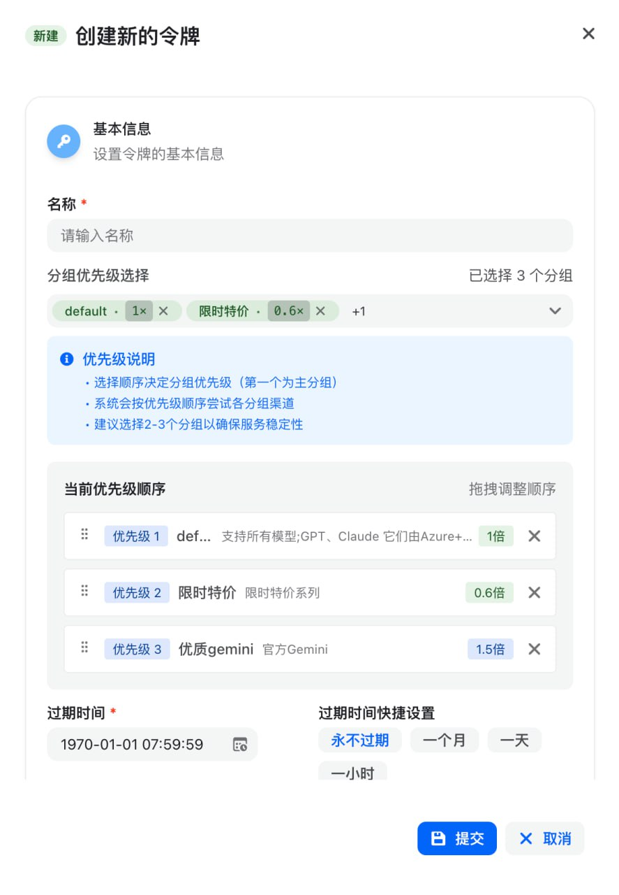

# 云雾图片生成器 🎨

[](https://opensource.org/licenses/MIT)

使用云雾 API（Gemini 3.1 Flash Image Preview）进行 AI 图片生成。支持文生图、图生图、多图融合，可切换尺寸和预设风格。

## ✨ 功能特性

| 功能 | 说明 |
|------|------|
| 🎨 **文生图** | 文字描述生成图片 |
| 🖼️ **图生图** | 上传图片 + 文字编辑 |
| 🔀 **多图融合** | 多张图片合成 |
| 📐 **14 种尺寸** | 1:1、9:16、16:9 等 |
| 🎭 **12 种风格** | anime、realistic、cyberpunk 等 |
| 📊 **4 种分辨率** | 0.5K ~ 4K |

## 🚀 快速开始

### 1. 注册云雾账号

👉 [点击注册云雾](https://yunwu.ai/register?aff=ltwW)

### 2. 获取 API Key

注册后在「控制台」获取 API Key

### 3. 配置

编辑 `config.json`，填入你的 API Key：

```json
{
  "apiKey": "你的API密钥",
  "defaultAspect": "1:1",
  "defaultSize": "1K",
  "defaultStyle": "default"
}
```

### 4. 运行

```bash
# 文生图
node generate.js "一只可爱的柴犬"

# 指定尺寸和风格
node generate.js "赛博朋克城市" --aspect 9:16 --style cyberpunk

# 图生图
node generate.js "改成油画风格" --images input.jpg
```

## 📐 尺寸选项

| 比例 | 适用场景 |
|------|---------|
| 1:1 | 社交媒体头像、方形内容 |
| 9:16 | 手机壁纸、短视频封面、Story |
| 16:9 | 横屏封面、YouTube 封面 |
| 4:3 | 传统照片比例 |
| 3:4 | 竖版照片 |
| 2:3 | 竖版海报 |
| 3:2 | 横版照片 |
| 21:9 | 电影宽屏 |
| 1:4 | 竖长条（仅 Gemini 3.1） |
| 4:1 | 横长条（仅 Gemini 3.1） |

## 🎭 预设风格

| 风格 | 说明 |
|------|------|
| `default` | 默认 |
| `anime` | 动漫风格 |
| `realistic` | 写实照片 |
| `oil-painting` | 油画风格 |
| `watercolor` | 水彩风格 |
| `pixel` | 像素艺术 |
| `3d` | 3D 渲染 |
| `sticker` | 贴纸风格 |
| `logo` | Logo 设计 |
| `sketch` | 素描风格 |
| `cyberpunk` | 赛博朋克 |
| `fantasy` | 奇幻风格 |

## 🔧 命令行参数

```bash
node generate.js "提示词" [选项]

选项:
  --aspect <比例>    设置图片比例 (默认: 1:1)
  --size <分辨率>    设置分辨率 (默认: 1K)
  --style <风格>     设置风格 (默认: default)
  --images <路径>    输入图片路径（图生图，逗号分隔）
  -o <文件名>        输出文件名

配置命令:
  --config           显示当前配置
  --set-aspect <比例> 设置默认比例
  --set-size <分辨率> 设置默认分辨率
  --set-style <风格>  设置默认风格
  --styles           列出所有风格
```

## 💡 云雾分组选择建议



### 分组说明

| 分组类型 | 特点 | 推荐场景 |
|---------|------|---------|
| **稳定分组** | 官方接口，稳定性最高 | 生产环境、重要任务 |
| **价格优势分组** | 价格更低，可能有波动 | 个人使用、测试开发 |
| **非官方分组** | 第三方接入，风险自担 | 不推荐 |

### 💡 建议

1. **生产环境** → 选择「稳定分组」，确保服务稳定性
2. **个人/测试** → 选择「价格优势分组」，性价比更高
3. **避免使用非官方分组**，存在安全风险

> ⚠️ 使用价格优势分组时，建议准备好备选方案，以防服务中断

## 📁 项目结构

```
yunwu-image-gen/
├── generate.js      # 主程序
├── config.json      # 配置文件
├── docs/
│   └── group-selection.jpg  # 分组选择截图
└── README.md
```

## 🔗 相关链接

- [云雾官网](https://yunwu.ai)
- [注册云雾](https://yunwu.ai/register?aff=ltwW)
- [Gemini API 文档](https://ai.google.dev/gemini-api/docs/image-generation)

## 📄 License

MIT License

---

*Powered by 云雾 AI + Gemini 3.1*